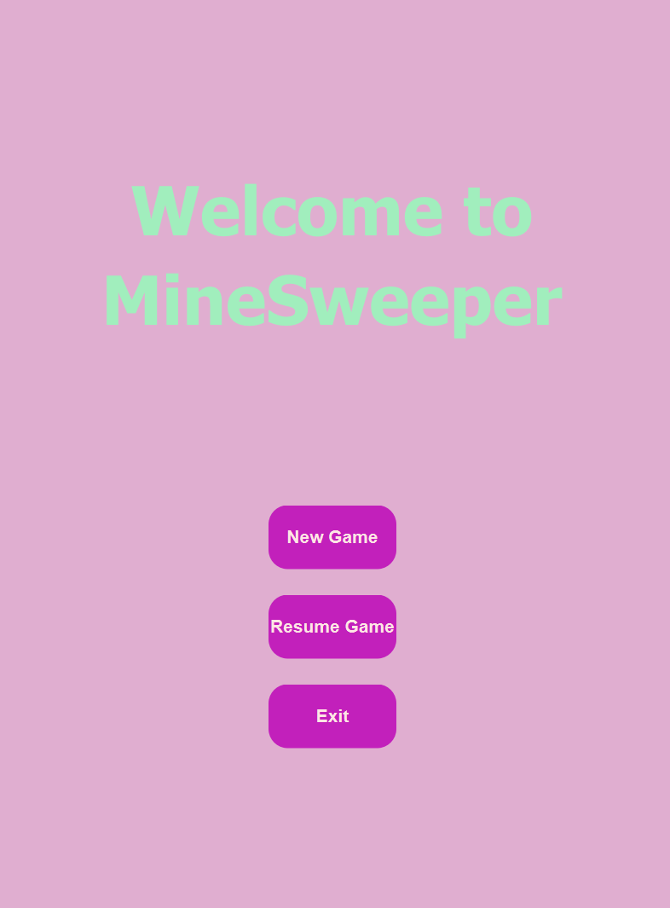
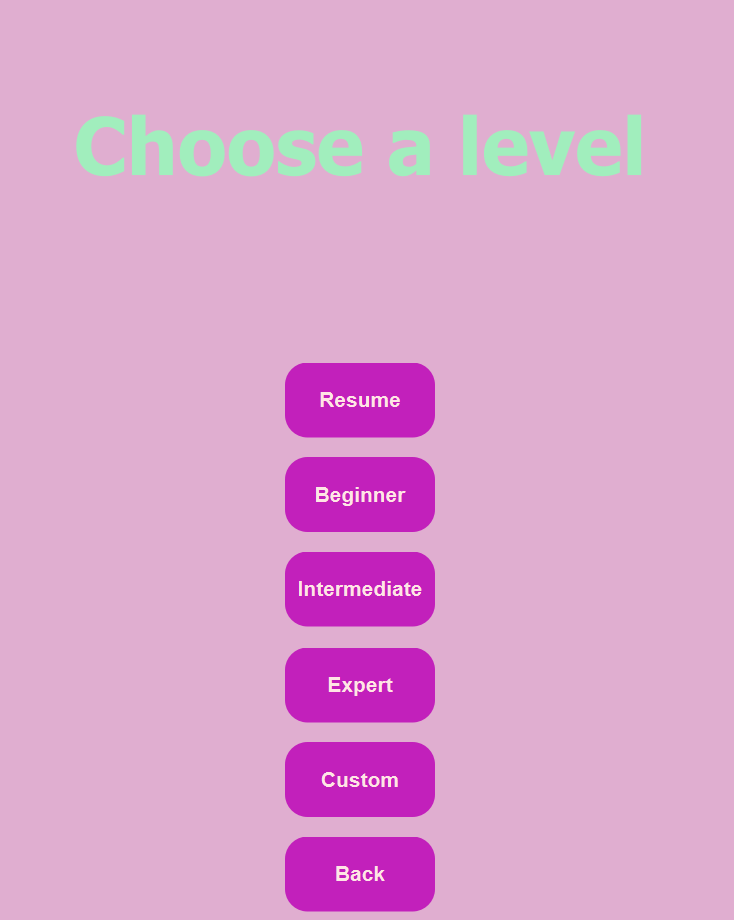
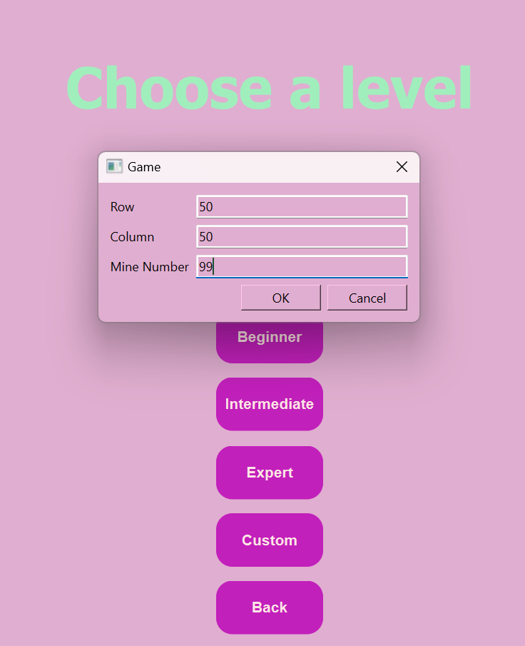

# Game Features

## Home Page

- `New Game`: redirect to the [Level Selection Page](#level-selection-page)
- `Resume Game`: redirect to the [Gameboard Page](#gameboard), and resume with the last game seession
- `Exit`: Exit the game session

## Level Selection Page

- `Resume`: continue with the last game session if it has been finished yet, otherwise, this button will not do anything

- `Beginner` `Intermediate` `Expert`: some pre-determined levels to choose
- `Custom`: customize your prefered board setup ( the max number of row and column is 50x50)
  
- `Back`: redirect back to the [Home Page](#home-page)

## Gameboard

- `Another level`: redirect to the [Level Selection Page](#level-selection-page), your progress will still be stored
- `Replay`: Replay this level
- `Exit`: Stop the game and save the current session
- `Gameboard`: - `single left-click` to reveal the square - `single right-click` to flag the square - `double left-click` to chord
  see the [Game rule](../README.md#gameplay) for more
