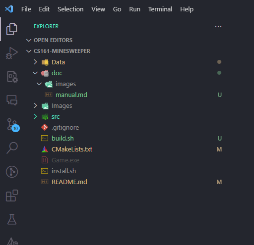
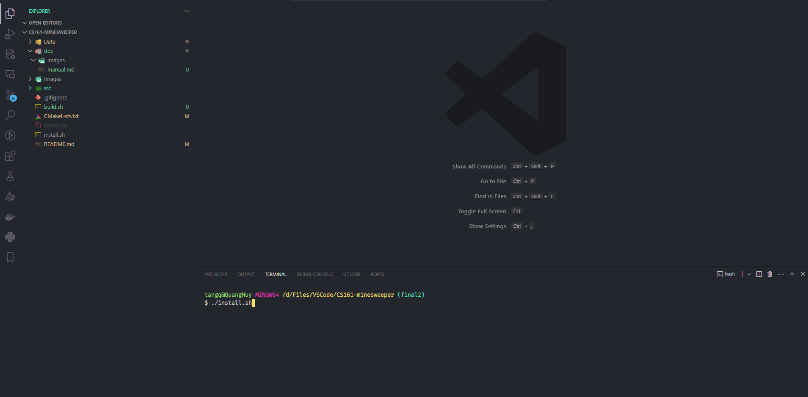
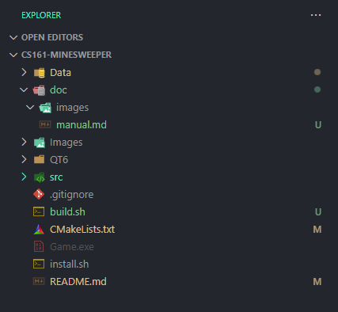
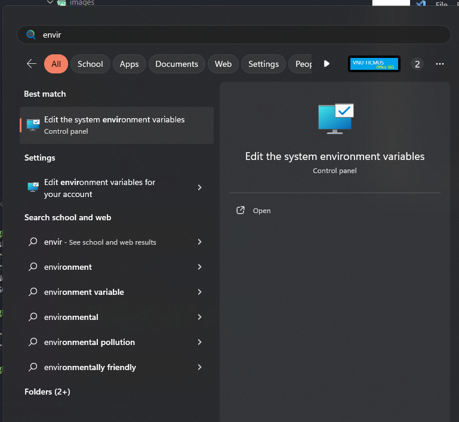
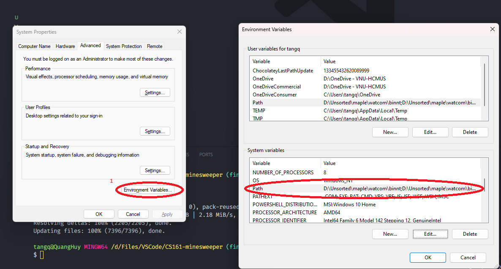
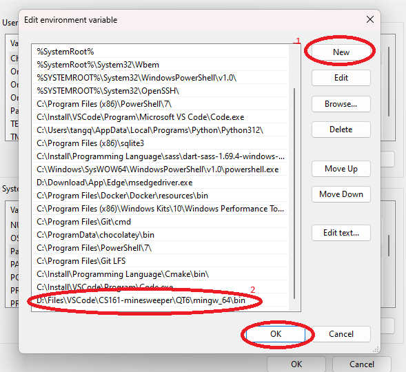
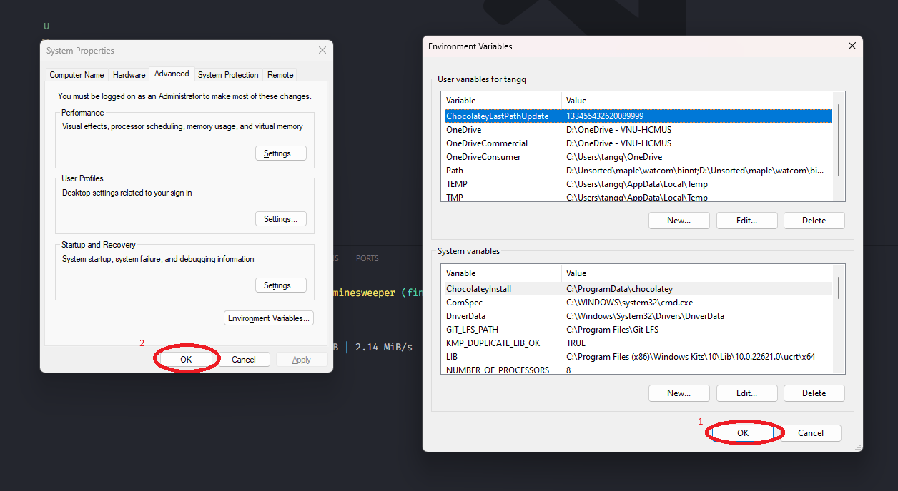
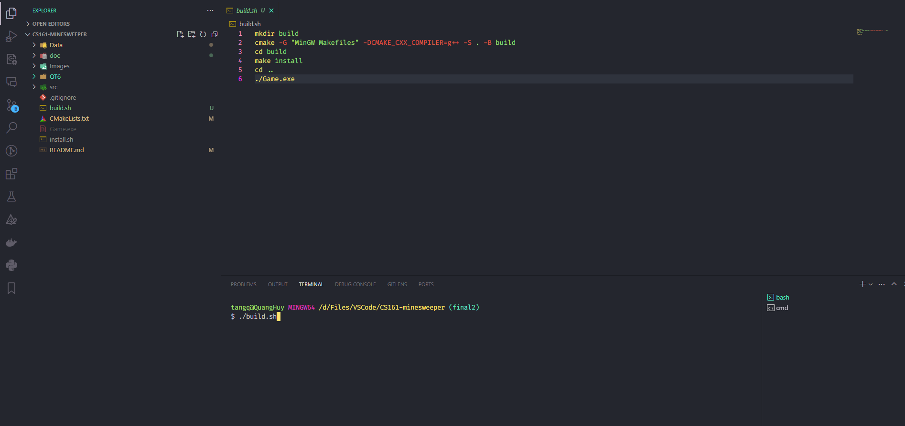
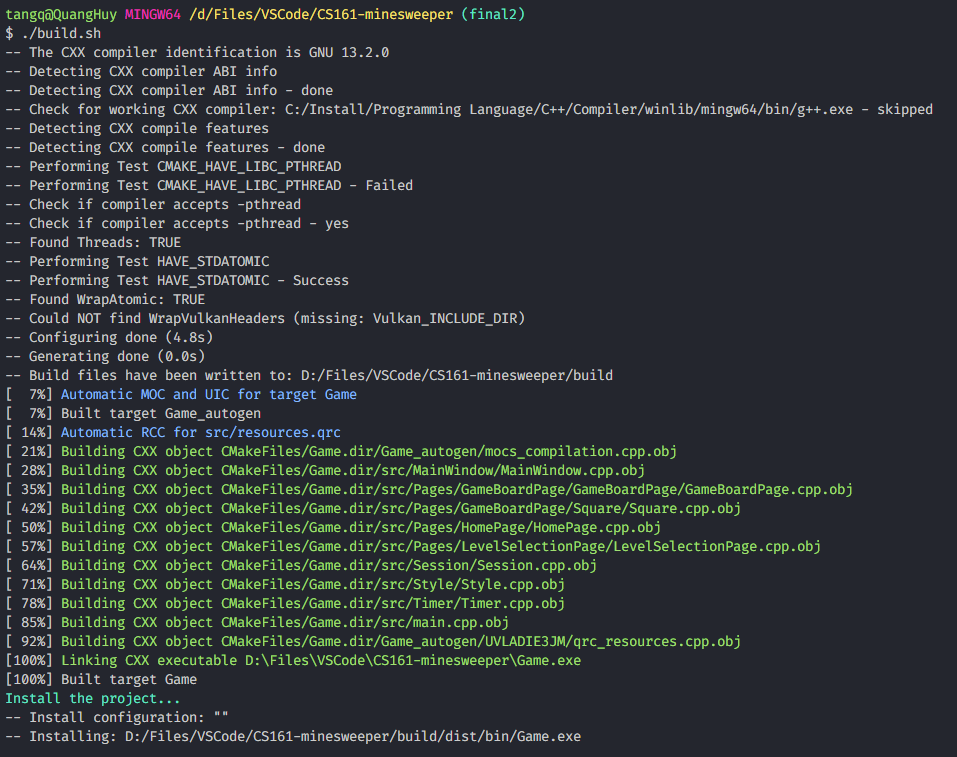

# Visual Manual

_"I am using VSCode here, but if you are using other IDE, the steps are pretty similar"_

- After unziping the .zip, your project will look like this
  

- Install QT with this script
  

- Successfully installed QT
  

- Paste QT into environment variable
  
  
  
  

- Build and run Game:
  
  

- And now you can enjoy the Game :heart_eyes::heart_eyes:
